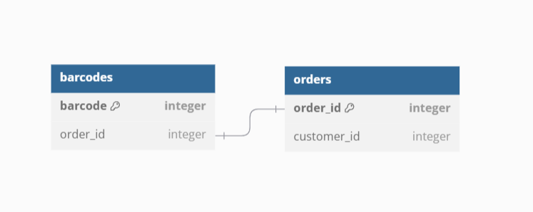

# Customer Bar Codes

## UML



## How to run

### Setup Environment

```sh
python3 -m venv venv
source venv/bin/activate
pip install -r requirements.txt
```

## Contributing

```sh
pip install -r requirements-dev.txt
```
